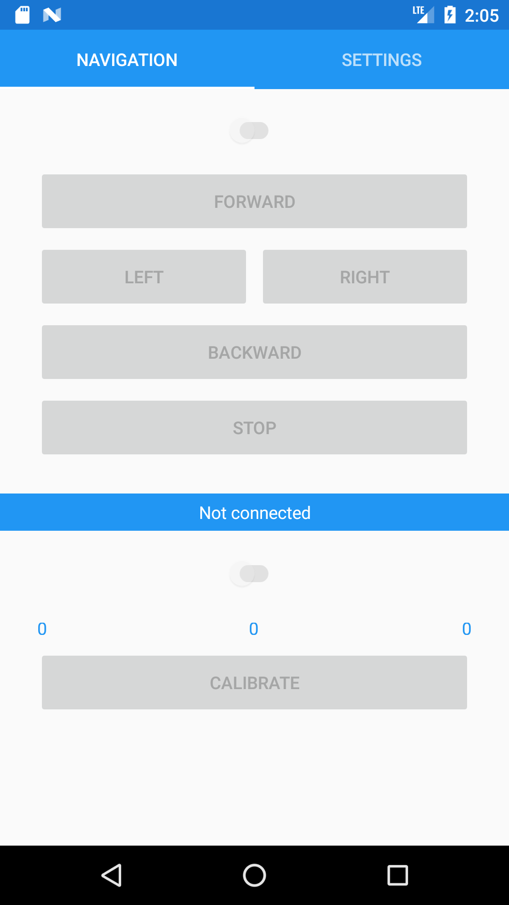
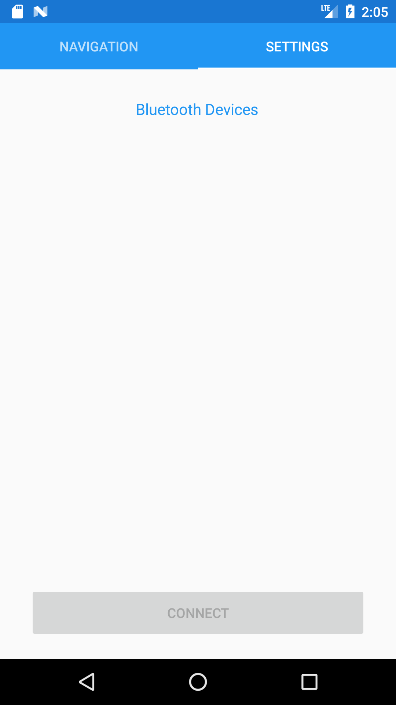

# Android RemoteControl for Lego® Mindstorms

## Introduction
My first <a href="https://visualstudio.microsoft.com/de/xamarin/" target="_blank">Xamarin</a> project which was intended for understanding <a href="https://docs.microsoft.com/de-de/xamarin/xamarin-forms/" target="_blank">Xamarin.Forms</a>, ui-binding and the MVVM pattern.
Thanks to <a href="https://twitter.com/mindstormsdk?lang=de" target="_blank">Anders Soborg</a> for providing a <a href="http://www.monobrick.dk/software/monobrick/" target="_blank">C# library</a> for the Lego® <a href="https://www.lego.com/de-de/mindstorms" target="_blank">Mindstorms</a> API and making the learning process much more fun.

## Features
* Connect via bluetooth
* Moving via buttons
* Moving via Accelerometer

## Made with
* Xamarin.Android 25.4.0.2 
* Xamarin.Forms 2.5.0.280555 
* VisualStudio for Windows
* [MonoBrick from Anders Soborg](https://github.com/AndersSoborg/MonoBrick-Communication-Software)

## Screenshots

    
    
